# HGH-AI 项目

## 简介

HGH-AI 是一个基于 Spring Boot 和 AI 技术的大模型应用。它集成了 OpenAI 和 Ollama 的聊天模型，使用RAG,Fuction Calling,Prompt等主流大模型应用架构，支持 PDF 知识库处理、课程管理、学校信息查询等功能，适用于教育、客服等场景。

以下是 AI 模型应用常见系统架构图，展示了纯 Prompt 回答、RAG（Retrieval-Augmented Generation）和 Function Calling 的架构对比。

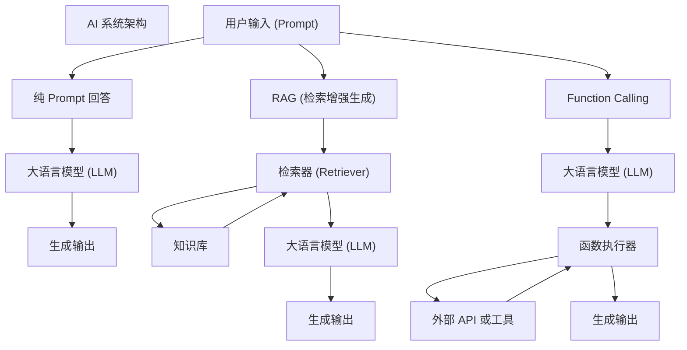

### 图解说明：

1. **纯 Prompt 回答**：

   - 用户输入直接传递给大语言模型。
   - 大语言模型根据内部训练的知识生成输出。
   - 流程简单，但受限于模型的知识范围。
2. **RAG（检索增强生成）**：

   - 用户输入首先传递给检索器。
   - 检索器从知识库中检索相关信息。
   - 检索到的信息与用户输入一起传递给大语言模型。
   - 大语言模型结合外部知识生成输出。
   - 适合需要实时访问动态或特定领域知识的场景。
3. **Function Calling**：

   - 用户输入传递给大语言模型。
   - 大语言模型解析输入并调用相应的函数。
   - 函数执行器负责调用外部 API 或工具完成任务。
   - 执行结果返回给大语言模型，最终生成输出。
   - 适合需要与外部系统交互或完成复杂任务的场景。

## 技术栈

- **编程语言**: Java 17
- **框架**:
  - Spring Boot 3.4.3
  - MyBatis Plus
  - Spring AI (OpenAI 和 Ollama 集成)
- **数据库**: MySQL
- **工具库**:
  - Lombok
  - VectorStore
  - PDF 文档读取工具
- **其他依赖**:
  - Maven 构建工具
  - Micrometer 观测工具

## 目录结构

### **1. 项目根目录**

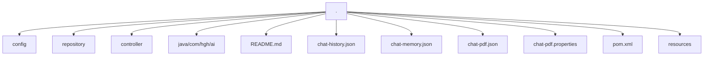

---

### **2. `config` 目录**

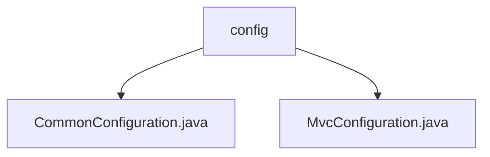

---

### **3. `repository` 目录**

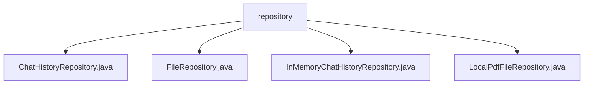

---

### **4. `controller` 目录**

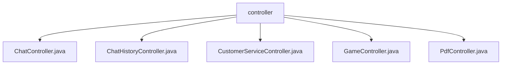

---

### **5. `java/com/hgh/ai` 目录**

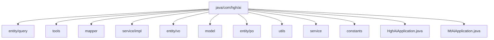

---

### **6. `entity/query` 目录**

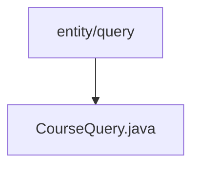

---

### **7. `tools` 目录**

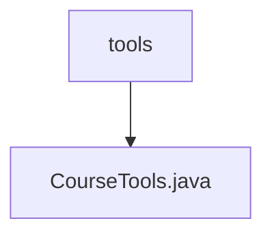

---

### **8. `mapper` 目录**

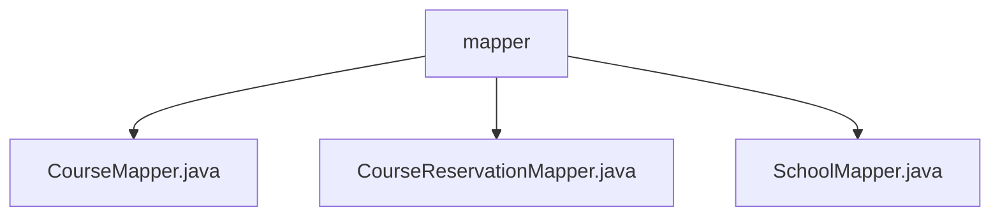

---

### **9. `service/impl` 目录**

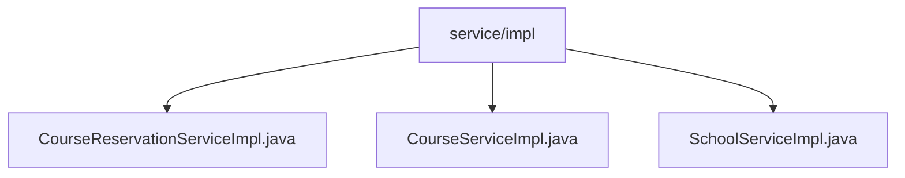

---

### **10. `entity/vo` 目录**

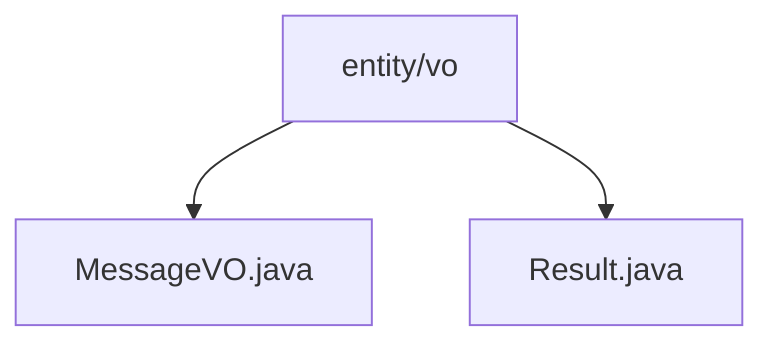

---

### **11. `model` 目录**

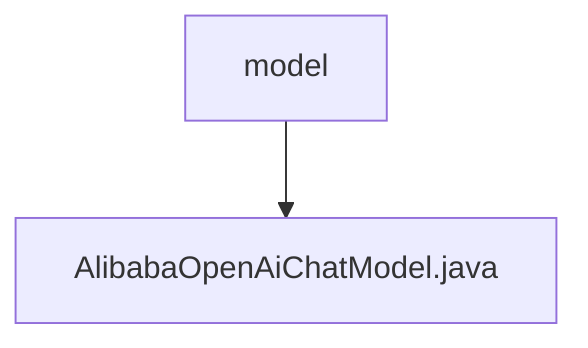

---

### **12. `resources` 目录**

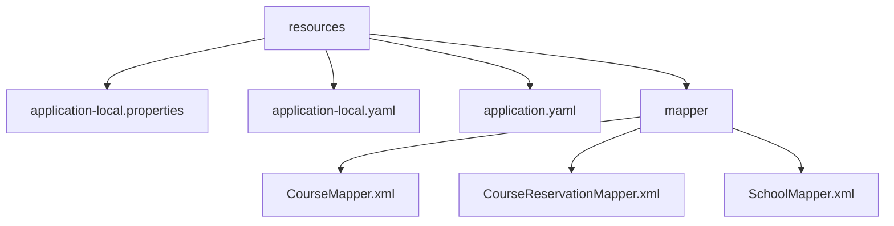

---

### **13. `entity/po` 目录**

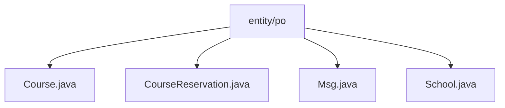

---

### **14. `utils` 目录**

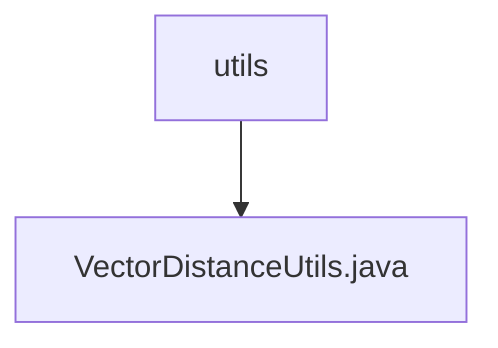

---

### **15. `service` 目录**

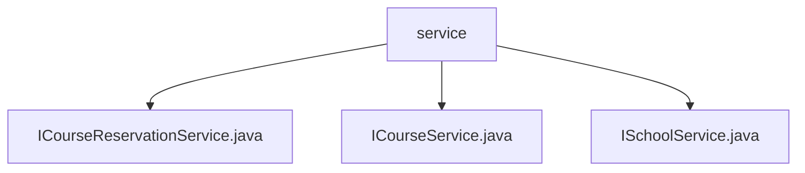

---

### **16. `constants` 目录**

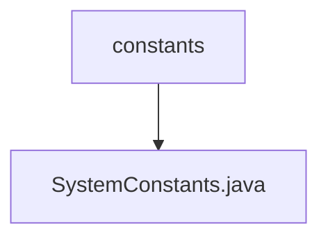

## 运行环境

- **JDK 版本**: 17
- **Spring Boot 版本**: 3.4.3
- **Maven 依赖**:
  - `com.baomidou:mybatis-plus-spring-boot3-starter==3.5`
  - `com.mysql:mysql-connector-j`
  - `org.projectlombok:lombok==1.18`
  - `org.springframework.ai:spring-ai-bom==1.0`
  - `org.springframework.ai:spring-ai-ollama-spring-boot-starter`
  - `org.springframework.ai:spring-ai-openai-spring-boot-starter`
  - `org.springframework.ai:spring-ai-pdf-document-reader`
  - `org.springframework.boot:spring-boot-starter-test`
  - `org.springframework.boot:spring-boot-starter-web`

## 使用说明

1. **克隆项目**
   bash git clone <项目仓库地址>
2. **安装依赖**
   bash mvn clean install
3. **配置文件**

   - 修改 `src/main/resources/application.yaml` 文件，配置数据库连接和其他必要参数。
4. **运行项目**
   bash mvn spring-boot:run
5. **访问接口**

   - 启动后，可以通过浏览器或 Postman 访问 `/chat`, `/course`, `/school` 等接口。

## 贡献指南

欢迎为本项目贡献代码！请遵循以下步骤：

1. Fork 本项目到您的 GitHub 账户。
2. 创建一个新的分支进行开发。
3. 提交 Pull Request，并详细描述您的更改内容。
4. 我们会尽快审核并合并您的代码。

## 联系方式

如有任何问题，请联系项目维护者：

- Email: [18319523592@163.com](https://github.com/niuhua6677)
- GitHub: [https://github.com/niuhua6677](https://github.com/niuhua6677)
